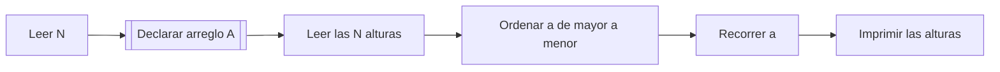

# C31O25. Wicked for stairs

**Autor:** wisperfrog

**Link:** [Wicked for stairs](https://cpcjudge.com/problem/wickedforstairs)

**Tiempo límite:** [0.5s]

**Memoria límite:** [256M]

## Descripción

Elphaba ha encerrado a Dorothy en lo más alto de su malvado castillo, pero Dorothy logró escapar del cuarto donde estaba encerrada. Dorothy corrió hacia las escaleras pero no puede bajar porque Elphaba desordenó los $N$
 escalones con su **magia malvada**.

Segundos después, llegó Glinda y le aventó su varita a Dorothy, para que con **magia buena**, pueda ordenar los escalones y así bajar mientras Glinda habla con Elphaba.

Como Dorothy está en lo más alto del castillo, deberá ordenar los escalones de forma que pueda **descender**.

## Entrada

En la primera línea un entero $N$ $(1 \leq N \leq 10^5)$, la cantidad de escalones.

En la segunda línea $N$ enteros $A_1, A_2, ..., A_N,$ donde $A_i$ $(1 \leq A_i \leq 10^9)$ indica la altura del $i-ésimo$ escalón. Todos los escalones están en alturas diferentes. 

## Salida

El orden en que Dorothy ordenó los $N$ escalones con la varita de Glinda.

## Ejemplos

### Ejemplo 1

#### Entrada

```text
7
1 2 3 5 6 8 10
```

#### Salida

```text
10 8 6 5 3 2 1
```
### Ejemplo 2

#### Entrada

```text
5
2 35 5 4 3
```

#### Salida

```text
35 5 4 3 2
```
### Ejemplo 3

#### Entrada

```text
1
5
```

#### Salida

```text
5
```


## Temas identificados

### Programación

- Arreglos
- Ordenamiento
- Ordenamiento descendente
- Algoritmos de ordenamiento

### Matemáticas

- Comparación de números
- Orden total de números enteros

## Propuesta de solución

**Autor de la propuesta:** mae

Como Dorothy se encuentra en la parte superior del castillo, necesita que los escalones queden ordenados desde la altura mayor hasta la menor para poder descender.

Primero se almacenan las alturas en un arreglo. Después, se utiliza un algoritmo de ordenamiento para organizar sus elementos de mayor a menor.

Finalmente, se recorre el arreglo desde la primera hasta la última posición y se imprimen las alturas ya ordenadas.

## Observaciones

- Todos los escalones tienen alturas diferentes.
- La salida debe estar ordenada de mayor a menor.
- Un arreglo es suficiente para almacenar las alturas.
- El valor máximo de $N$ es $10^5$, por lo que se puede declarar un arreglo con espacio para $100005$ elementos.
- Si $N=1$, no es necesario realizar ningún cambio, ya que un solo elemento ya está ordenado.

## Restricciones

El problema establece $1 \leq N \leq 10^5$

Por lo tanto, se puede utilizar un arreglo tradicional de tamaño máximo 100005 

Cada elemento puede tener un valor de hasta $10^9$, este valor puede almacenarse utilizando el tipo int de C++, cuyo rango permite representar números de ese tamaño.

Para que el algoritmo sea eficiente con hasta $10^5$ elementos, se utiliza un algoritmo de ordenamiento con complejidad $O(N\log N)$.

## Estados o estructura de la solución

- $n$: almacena la cantidad de escalones.
- $a$: arreglo que almacena las alturas de los escalones.
- $i$: variable utilizada para recorrer el arreglo.

## Casos base

El caso base ocurre cuando $N=1$.

En este caso solamente existe un escalón, por lo que no es necesario realizar ningún intercambio ni ordenamiento.

## Transiciones o algoritmo

El algoritmo consiste en los siguientes pasos:

Leer la cantidad de escalones N.
Crear un arreglo con N posiciones.
Leer las N alturas y almacenarlas en el arreglo.
Ordenar el arreglo de mayor a menor.
Recorrer el arreglo e imprimir sus elementos.

El ordenamiento puede realizarse utilizando sort de C++ con un comparador que coloque primero los valores mayores.



## Correctitud

El algoritmo almacena en el arreglo todas las alturas proporcionadas en la entrada.

Después, sort reorganiza los elementos utilizando $greater<int>()$, por lo que los valores quedan ordenados de mayor a menor.

## Complejidad computacional

- Tiempo: $O(N\log N)$
- Memoria: $O(N)$

## Implementación

### C++

**Autor de la implementación:** mae

```cpp
#include <bits/stdc++.h>

using namespace std;

int main()
{
    cin.tie(0);
    ios_base::sync_with_stdio(false);

    int n;
    cin >> n;
    int a[100005];
    for (int i = 0; i < n; i++){
        cin >> a[i];
    }

    sort(a, a + n, greater<int>());

    for (int i = 0; i < n; i++)
    {
        cout << a[i];
        if (i < n - 1){
            cout << " ";
        }
    }
}

```

## Casos límite

- $N=1$: solamente existe un escalón. El algoritmo imprime directamente su altura.
- $N=10^5$: se procesan cien mil alturas. El algoritmo de ordenamiento $O(N\log N)$ permite manejar esta cantidad de datos.
- Valores cercanos al límite: las alturas pueden llegar hasta $10^9$, por lo que el tipo int de C++ es suficiente para almacenarlas.
- Arreglo inicialmente desordenado: el algoritmo reorganiza todas las alturas de mayor a menor.
- Arreglo inicialmente ordenado de menor a mayor: el algoritmo invierte el orden mediante el proceso de ordenamiento.
