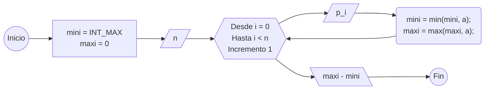

# H. Hlaalu's Ebony

**Autor:** [Autor del problema]

**Link:** [H. Hlaalu's Ebony](https://codeforces.com/gym/106710/problem/H)

**Tiempo límite:** 1 s

**Memoria límite:** 256 MB

## Description

Word has reached House Hlaalu of a merchant blessed with a satchel of Almsivi Intervention scrolls — the Tribunal's gift that lets one step instantly to the nearest temple anywhere on Vvardenfell. No longer bound to the silt strider's fixed path, the merchant may appear at any settlement, in any order, to trade raw ebony.

At each of the $N$ settlements, the price of raw ebony is known. The merchant will buy one unit at a settlement and sell it at a (possibly identical) settlement. Since travel order is unrestricted, the maximum profit is the largest selling price minus the smallest buying price. If all prices are equal, the answer is $0$.

Given the prices at all $N$ settlements, determine the maximum profit the merchant can achieve.

## Input

The first line contains a single integer $N$ $(2 \le N \le 2 \cdot 10^5)$, the number of settlements on Vvardenfell where raw ebony is traded.

The second line contains $N$ integers $p_1, p_2, \ldots, p_N$ $(1 \le p_i \le 10^9)$, where $p_i$ is the price of one unit of raw ebony at the $i$-th settlement.

## Output

Print a single integer: the maximum profit the merchant can achieve.

## Examples

### Example 1

#### Input

```text
5
7 1 5 3 6
```

#### Output

```text
6
```

### Example 2

#### Input

```text
3
10 10 10
```

#### Output

```text
0
```

## Temas identificados

### Programación

- Ciclos

### Matemáticas

- Máximos y mínimos

## Propuesta de solución

**Autor de la propuesta:** Jordan

El mercader busca comprar la madera de ébano al menor precio posible para venderla con la mayor ganancia posible.

La mayor ganancia posible se puede obtener al restar el producto más caro con el más barato.

## Observaciones

- Encuentra el elemento más grande y el más pequeño, para restar el mayor menos el menor.

## Transiciones o algoritmo

[Explica paso a paso la transición entre estados o el algoritmo general.]



## Correctitud

Mientras las entradas se leen, se identifica si el número entrante es menor que el número mínimo encontrado anteriormente, además de identificarse si el número es mayor que el número máximo encontrado anteriormente, por lo que siempre se asegura que se va a encontrar el número mayor y el número menor de las entradas dadas.

## Complejidad computacional

- Tiempo: $O(N)$

## Implementación

### C++

**Autor de la implementación:** Jordan

```cpp
#include <bits/stdc++.h>

using namespace std;

int main() {
    cin.tie(0); ios::sync_with_stdio(0);

    int mini = INT_MAX, maxi = 0;
    int n;
    cin >> n;
    for (int i = 0; i < n; i++) {
        int p;
        cin >> p;
        mini = min(mini, p);
        maxi = max(maxi, p);
    }

    cout << maxi - mini;

    return 0;
}
```

## Casos límite

- El número mayor que se da es ${10^9}$, INT_MAX es mayor que el número máximo dado.
- El número menor que se da es 1, $0$ es menor que el número mínimo dado.
